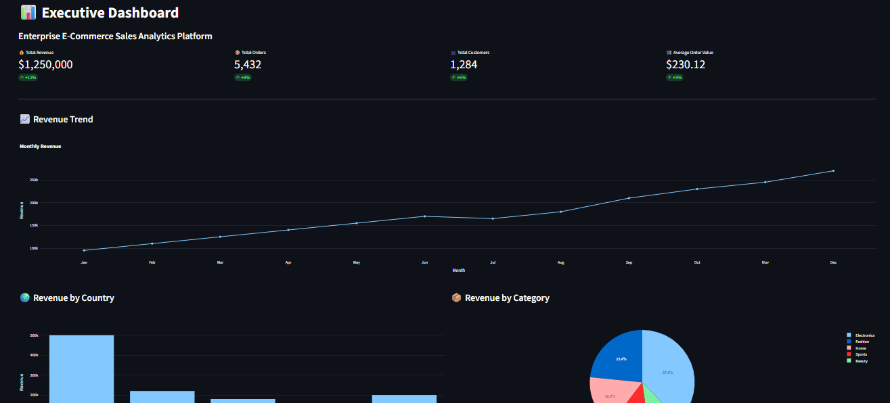
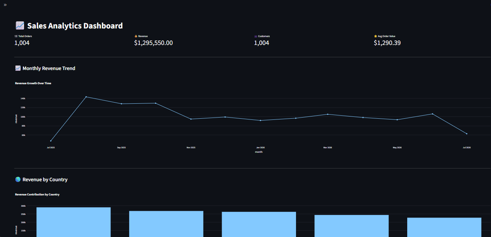
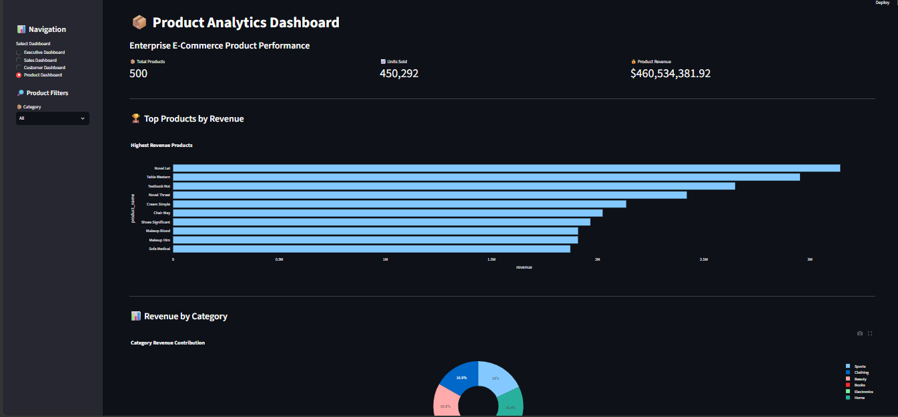
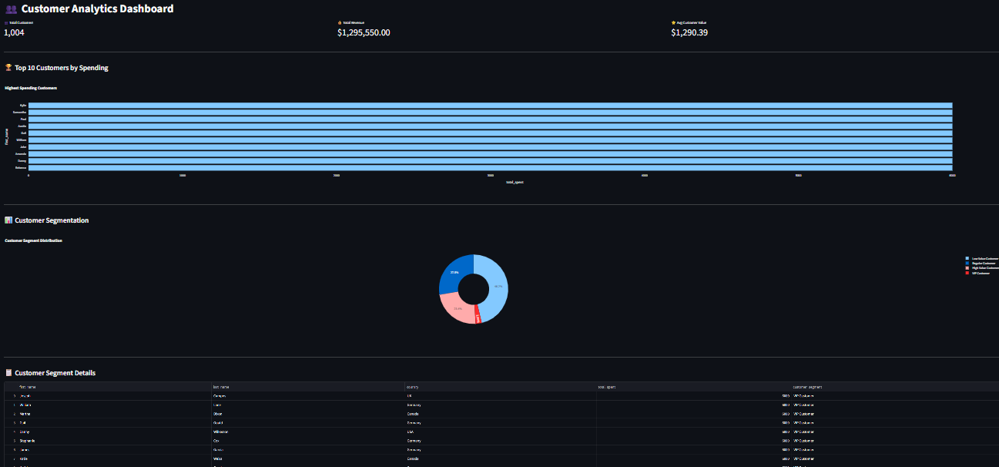

# 📊 Enterprise Ecommerce Sales Analytics Platform

An end-to-end **Enterprise E-Commerce Sales Analytics Platform** built using **Python, PostgreSQL, SQL, Streamlit, and Plotly**.

This project simulates a real-world Business Intelligence (BI) solution by generating ecommerce transaction data, building an ETL pipeline, storing analytical data in a PostgreSQL database, and delivering interactive dashboards for executive decision-making.

The platform enables businesses to analyze:

- 📈 Sales performance and revenue trends
- 🌎 Geographic revenue distribution
- 📦 Product and category performance
- 👥 Customer purchasing behavior
- 🎯 Customer segmentation and value analysis

---

## 🚀 Project Highlights

- Built an automated **ETL pipeline** to extract, transform, and load ecommerce data.
- Designed a PostgreSQL data model for customers, products, orders, and transactions.
- Developed SQL-based analytics queries for business metrics.
- Created interactive Streamlit dashboards with Plotly visualizations.
- Implemented customer segmentation to identify VIP and high-value customers.
- Developed executive KPI dashboards for data-driven decision-making.

---

## 🛠️ Technology Stack

**Programming**
- Python

**Database**
- PostgreSQL
- Supabase

**Data Engineering**
- ETL Pipeline
- Pandas
- SQLAlchemy

**Analytics & Visualization**
- SQL
- Streamlit
- Plotly

**Version Control**
- Git
- GitHub

---

## 📊 Dashboard Screenshots

### Executive Dashboard

### Sales Dashboard

### Product Dashboard

### Customer Dashboard

## 📁 Project Structure

enterprise-ecommerce-sales-analytics/

│
├── data/
│ └── ecommerce_data.csv

├── screenshots/
│ ├── executive_dashboard.png
│ ├── sales_dashboard.png
│ ├── product_dashboard.png
│ └── customer_dashboard.png

├── app.py
├── database.py
├── etl_pipeline.py
├── requirements.txt
├── README.md
└── .gitignore

### File Description

- **app.py** → Streamlit dashboard application
- **database.py** → PostgreSQL database connection setup
- **etl_pipeline.py** → Data generation, cleaning, and loading process
- **requirements.txt** → Required Python libraries
- **screenshots/** → Dashboard images for documentation