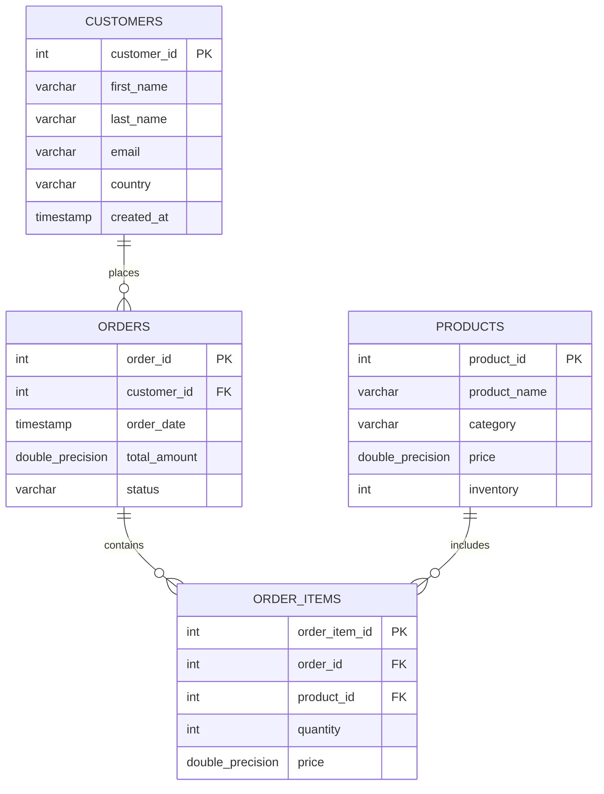

# 📊 Enterprise Ecommerce Sales Analytics Platform

An end-to-end **Enterprise E-Commerce Sales Analytics Platform** built using **Python, PostgreSQL, SQL, Streamlit, and Plotly**.

This project simulates a real-world Business Intelligence (BI) solution by generating ecommerce transaction data, building an ETL pipeline, storing analytical data in a PostgreSQL database, and delivering interactive dashboards for executive decision-making.

The platform enables businesses to analyze:

- 📈 Sales performance and revenue trends
- 🌎 Geographic revenue distribution
- 📦 Product and category performance
- 👥 Customer purchasing behavior
- 🎯 Customer segmentation and value analysis

---

## 🚀 Project Highlights

- Built an automated **ETL pipeline** to extract, transform, and load ecommerce data.
- Designed a PostgreSQL data model for customers, products, orders, and transactions.
- Developed SQL-based analytics queries for business metrics.
- Created interactive Streamlit dashboards with Plotly visualizations.
- Implemented customer segmentation to identify VIP and high-value customers.
- Developed executive KPI dashboards for data-driven decision-making.

---

## 🛠️ Technology Stack

### Programming
- Python

### Database
- PostgreSQL
- Supabase

### Data Engineering
- ETL Pipeline
- Pandas
- SQLAlchemy

### Analytics & Visualization
- SQL
- Streamlit
- Plotly

### Version Control
- Git
- GitHub

---
## 📊 Dashboard Screenshots

### Executive Dashboard


Provides high-level business KPIs including:

- Total Revenue
- Total Orders
- Average Order Value
- Revenue Trends
- Business Performance Overview


### Sales Dashboard


Analyzes:

- Revenue trends over time
- Sales performance
- Geographic revenue distribution
- Order patterns


### Product Dashboard


Provides insights into:

- Product performance
- Category-level revenue analysis
- Top-performing products
- Product contribution to sales


### Customer Dashboard


Analyzes:

- Customer purchasing behavior
- Customer segmentation
- VIP customers
- High-value customer analysis

---

## 📁 Project Structure

```text
enterprise-ecommerce-sales-analytics/

│
├── data/
│   └── ecommerce_data.csv
│
├── screenshots/
│   ├── executive_dashboard.png
│   ├── sales_dashboard.png
│   ├── product_dashboard.png
│   └── customer_dashboard.png
│
├── app.py
├── database.py
├── etl_pipeline.py
├── requirements.txt
├── README.md
└── .gitignore
```

### File Description

- **app.py** → Streamlit dashboard application
- **database.py** → PostgreSQL database connection setup
- **etl_pipeline.py** → Data generation, cleaning, and loading process
- **requirements.txt** → Required Python libraries
- **screenshots/** → Dashboard images for documentation

---

## 🏗️ System Architecture

The platform follows an end-to-end analytics workflow:

```text
E-Commerce Data Generation
            |
            ↓
        ETL Pipeline
(Python + Pandas + SQLAlchemy)
            |
            ↓
    PostgreSQL Database
(Customers | Products | Orders)
            |
            ↓
    SQL Analytics Layer
(Business Metrics & KPIs)
            |
            ↓
 Streamlit + Plotly Dashboard
(Executive | Sales | Product | Customer)
```

### Data Flow Explanation

- **Data Generation:** Creates realistic ecommerce transaction data.
- **ETL Pipeline:** Cleans, transforms, and loads data into PostgreSQL.
- **Database Layer:** Stores structured customer, product, and order information.
- **SQL Analytics:** Calculates business KPIs and analytical metrics.
- **Visualization Layer:** Provides interactive dashboards using Streamlit and Plotly.

---

## 🗄️ Database Schema

The platform uses a relational PostgreSQL data model designed for ecommerce analytics.


---

## 📈 SQL Analytics Layer

The platform uses SQL queries to transform raw transactional data into meaningful business insights.

The analytics layer calculates key performance indicators (KPIs) across sales, products, customers, and geographic performance.

---

## 🎯 Business Metrics & KPIs

### Revenue Metrics

| KPI | Description |
|---|---|
| Total Revenue | Overall revenue generated from completed orders |
| Total Orders | Number of customer transactions |
| Average Order Value | Average revenue per order |
| Monthly Revenue Trend | Revenue performance over time |

---

### Product Analytics

| KPI | Description |
|---|---|
| Top Selling Products | Products generating highest revenue |
| Category Performance | Revenue contribution by product category |
| Product Sales Volume | Quantity sold by product |

---

### Customer Analytics

| KPI | Description |
|---|---|
| Customer Segmentation | Identifies high-value customers |
| Customer Revenue Ranking | Ranks customers based on spending |
| Purchase Behavior | Analyzes customer ordering patterns |

---

### Geographic Analytics

| KPI | Description |
|---|---|
| Revenue by Country | Identifies high-performing regions |
| Customer Distribution | Customer concentration by location |

---

## 🧮 Sample SQL Analytics Queries

### Total Revenue

```sql
SELECT 
    SUM(total_amount) AS total_revenue
FROM orders;
```

---

### Total Orders

```sql
SELECT
    COUNT(order_id) AS total_orders
FROM orders;
```

---

### Average Order Value

```sql
SELECT
    AVG(total_amount) AS average_order_value
FROM orders;
```

---

### Revenue by Category

```sql
SELECT
    p.category,
    SUM(oi.quantity * oi.price) AS revenue
FROM order_items oi
JOIN products p
ON oi.product_id = p.product_id
GROUP BY p.category
ORDER BY revenue DESC;
```

---

### Top Customers by Revenue

```sql
SELECT
    c.first_name,
    c.last_name,
    SUM(o.total_amount) AS customer_revenue
FROM customers c
JOIN orders o
ON c.customer_id = o.customer_id
GROUP BY c.first_name, c.last_name
ORDER BY customer_revenue DESC;
```

---

## 📊 Analytics Workflow

```text
Raw Transaction Data

        ↓

PostgreSQL Tables

(Customers | Products | Orders | Order Items)

        ↓

SQL Transformations

        ↓

Business KPIs

        ↓

Interactive Streamlit Dashboards
```

---

### Database Design Explanation

The database follows a normalized relational schema optimized for ecommerce analytics and business intelligence reporting.

- **Customers Table:** Stores customer profile information including names, email details, country, and account creation timestamps.
- **Products Table:** Maintains product catalog information including product names, categories, pricing, and available inventory.
- **Orders Table:** Captures customer transactions including order dates, order status, and total order amounts.
- **Order Items Table:** Stores individual products purchased within each order, including quantity and the price at the time of purchase.

### Database Design Considerations

- The schema follows a **normalized relational database design** to reduce data duplication and improve data consistency.
- Primary keys uniquely identify records across all entities.
- Foreign keys maintain relationships between customers, orders, products, and transactions.
- The `order_items.price` column stores the product price at the time of purchase to preserve historical transaction accuracy even when product prices change.
- Indexing foreign key columns such as `orders.customer_id` and `order_items.product_id` improves query performance for analytical workloads.

---

## ⚙️ Project Setup & Installation

### 1. Clone Repository

```bash
git clone https://github.com/yaswanthsivala-wq/enterprise-ecommerce-sales-analytics.git

cd enterprise-ecommerce-sales-analytics
```

---

### 2. Create Virtual Environment

```bash
python -m venv venv
```

Activate environment:

Windows:

```bash
venv\Scripts\activate
```

---

### 3. Install Dependencies

```bash
pip install -r requirements.txt
```

---

### 4. Configure Database Connection

Create a `.env` file in the project root:

```env
DATABASE_URL=your_postgresql_connection_string
```

The application connects to PostgreSQL using SQLAlchemy.

---

### 5. Run ETL Pipeline

Generate and load ecommerce data:

```bash
python etl_pipeline.py
```

The pipeline performs:

- Data generation
- Data cleaning
- Data transformation
- Loading data into PostgreSQL tables

---

### 6. Launch Dashboard

Run Streamlit application:

```bash
streamlit run app.py
```

The dashboard will open in your browser.

---

# 📌 Future Enhancements

Planned improvements:

- Add cloud deployment using AWS / Azure
- Implement automated data pipelines using Apache Airflow
- Add data warehouse modeling using Snowflake
- Introduce machine learning models for:
  - Customer churn prediction
  - Sales forecasting
  - Product recommendation systems
- Add CI/CD pipeline using GitHub Actions

---

# 👨‍💻 Author

**Yaswanth Sivala**

Data Engineer | Analytics Engineer | AI/ML Enthusiast

GitHub:
https://github.com/yaswanthsivala-wq
